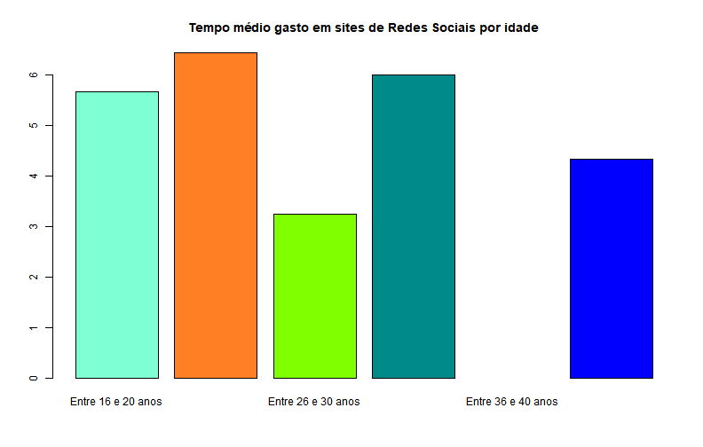
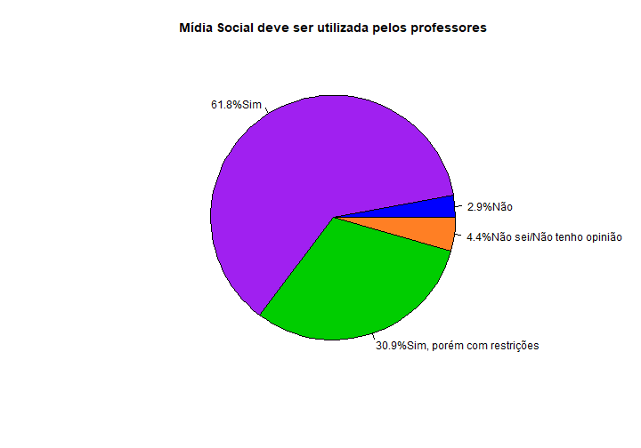
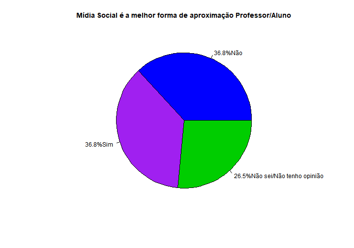
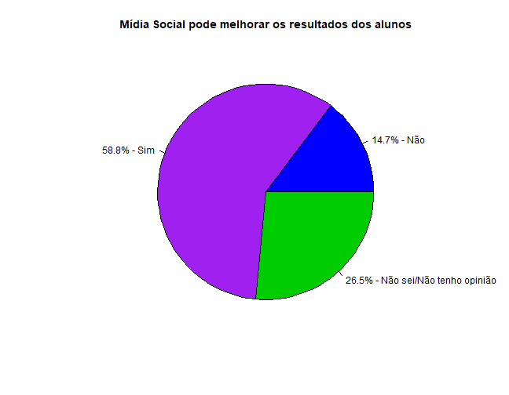
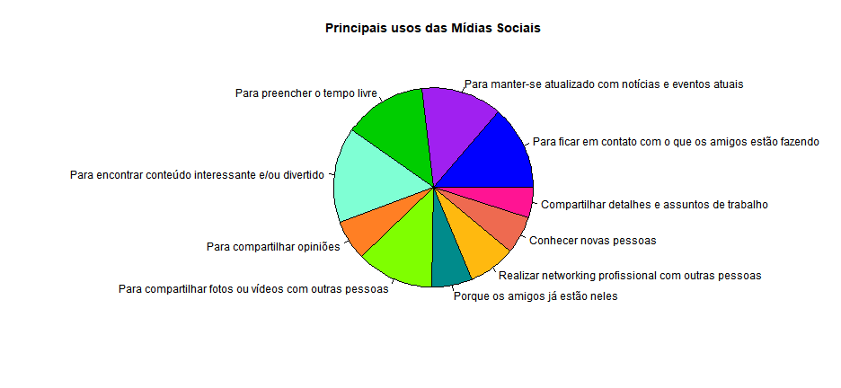
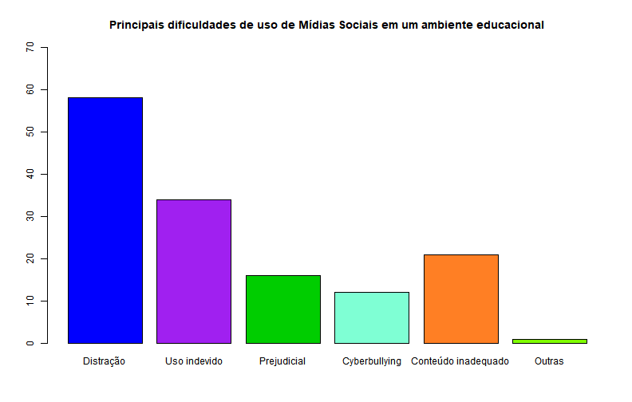
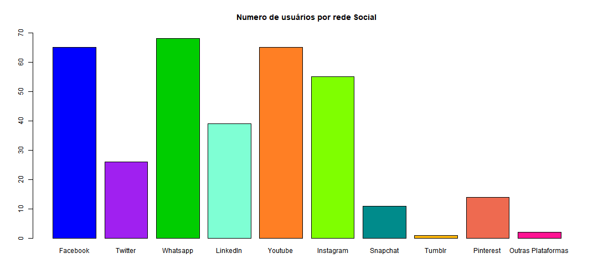
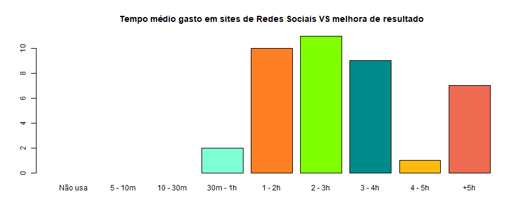

Ciência de dados
========================================================
Uma análise sobre as  influências das mídias  sociais nos alunos da  UNESP
  
Bruno Carvalho Logerfo &nbsp;&nbsp;&nbsp;&nbsp;&nbsp;&nbsp;&nbsp;&nbsp;&nbsp;&nbsp;&nbsp;&nbsp;&nbsp;&nbsp;&nbsp;&nbsp;&nbsp;&nbsp;&nbsp;&nbsp;&nbsp;&nbsp;151023336    
Gustavo Hildebrand Batista &nbsp;&nbsp;&nbsp;&nbsp;&nbsp;&nbsp;&nbsp;&nbsp;&nbsp;&nbsp;&nbsp;&nbsp;&nbsp;151024693  
João Victor Fayad Andreotti &nbsp;&nbsp;&nbsp;&nbsp;&nbsp;&nbsp;&nbsp;&nbsp;&nbsp;&nbsp;&nbsp;&nbsp;151023115  
Lucas Fernandes Nogueira &nbsp;&nbsp;&nbsp;&nbsp;&nbsp;&nbsp;&nbsp;&nbsp;&nbsp;&nbsp;&nbsp;&nbsp;&nbsp;&nbsp;&nbsp;&nbsp;151022658  
Pedro Guilherme Somenci Silva &nbsp;&nbsp;&nbsp;&nbsp;151024464

Introdução
========================================================

- Com a Internet a comunicação e troca de informações se tornou muito mais simples e prática.

- Dando força para as <b>Redes Sociais</b>. Com maior popularidade entre os jovens.

- Dentre as mais notáveis temos: 
  - Facebook, YouTube, Twitter, WhatsApp.

Com base num questionário respondido pelos alunos, neste relatório buscamos responder a seguinte pergunta:

**Quais são as influências das mídias sociais sobre discentes da instituição de nível superior UNESP-Bauru-SP?**

Relação idade e o tempo nas redes sociais
========================================================

  

Relação idade e o tempo nas redes sociais
========================================================

- Utilização continua predominantemente entre os jovens.

- Sendo os de 21 a 25 anos os principais utilizadores.

- Principal faixa etária que compõe as instituições de ensino superior.
  - Sendo interessante para a utilização no meio acadêmico

Redes sociais como ferramenta de ensino                 
========================================================

***

Redes sociais como ferramenta de ensino
========================================================

- Ampla maioria concorda com a utilização pelo professor

- Não há definição clara se a mídia é a melhor forma de aproximação professor/aluno

Mídias sociais melhorando resultados
========================================================

Mídias sociais melhorando resultados
========================================================

- Maioria concorda numa melhora de resultados através da rede social

- Grande parte (26,5%) não sabe afirmar se é uma boa forma melhorar resultados
  - Demonstrando a necessidade de testes validação do método
  
Tipos de uso
========================================================
  

Tipos de uso
========================================================

- Predomínio do tempo livre e encontrar conteúdo com base nos interesses

- Parcela significativa de uso para compartilhamento de arquivos
  - Podendo demonstrar a aplicação como ferramenta de uso acadêmico (troca de informações)
  
Os problemas das mídias sociais
========================================================

Os problemas das mídias sociais
========================================================

- Distração principal dificuldade a ser enfrentada

- Seguido de uso indevido e conteúdo inadequado

- Dificuldades enfrentadas na utilização de plataforma abrangentes, não dedicadas

Onde os alunos estão?
========================================================

Onde os alunos estão?
========================================================

- Por onde começar?
  - Professores devem focar nos principais: 
    - Facebook e WhatsApp
  
  - Com atenção ao Youtube caso tenham grande demanda por vídeos

O tempo gasto influência na crença que o seu uso pode melhorar os resultados?
========================================================

- Pessoas que utilizam a rede social por mais tempo acreditam com maior frequência que o seu uso pode melhorar os resultado.

Conclusão
========================================================

- Instituições estão começando a adotar as redes sociais para auxiliar no ensino.
- Alunos acham que é uma técnica interessante podendo melhorar o aproveitamento em sala de aula.
  - Com melhora do aprendizado, praticidade, facilidade no acesso às informações. 
- Ainda existe resistência por meio dos professores.
  - Dado a dificuldade de se controlar, em sala de aula, o que os alunos estão fazendo em seus celulares ou computadores.
- Vale ressaltar que por mais que as Redes ou Mídias Sociais possam auxiliar no aprendizado, as mesmas não substituem o próprio professor.

Referências Bibliográficas
========================================================

CARVALHO JR., Arlindo. **As redes sociais como ferramentas didáticas virtuais de interação e ensino**. Disponível em: <http://educacaopublica.cederj.edu.br/revista/artigos/as-redes-sociais-como-ferramentas-didaticas-virtuais-de-interacao-e-ensino>. Acesso em: 26 de nov. de 2018

MEIRA, Samara. **REDES SOCIAIS COMO FERRAMENTA DE ENSINO DOS FENÔMENOS ÓPTICOS**. Disponível em: <http://mnpef.fis.unb.br/download/dissertacao_samara.pdf>. Acesso em: 26 de nov. de 2018
